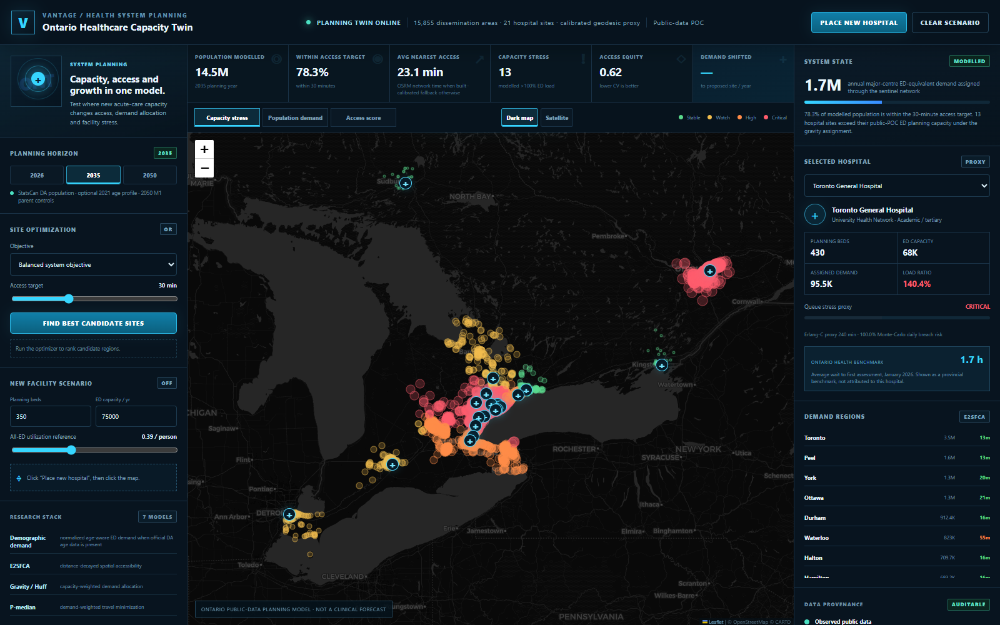
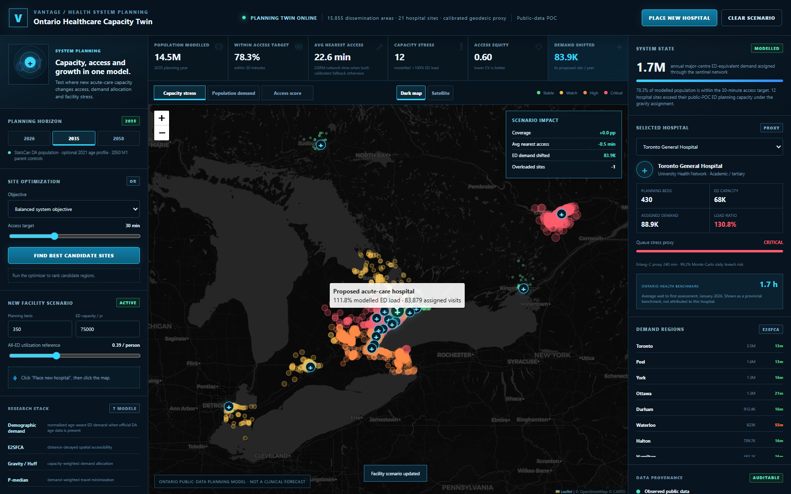

# Ontario Healthcare Capacity Twin

A research-backed public-data digital twin for exploring **healthcare capacity, geographic access and new-facility location scenarios in Ontario**.

The application combines real public population geography and real hospital locations with explicit planning models. It is a planning POC and does not claim to reproduce patient-level clinical flows or predict individual healthcare use.

## Current model resolution

The bundled runtime uses **15,855 populated Statistics Canada dissemination areas** across the 17 census divisions covered by the public POC. The validated dataset is committed at `data/processed/demand_nodes_da.json.gz`; the original 17 census-division anchors remain a deterministic fallback and provide the 2025/2050 parent control totals.

The DA layer is generated reproducibly from the 2021 Geographic Attribute File by aggregating observed dissemination-block population into each DA and retaining Statistics Canada's population-weighted DA representative coordinates. The observed 2021 DA spatial distribution is then reconciled exactly to the parent 2025 population estimates and 2050 M1 control totals. The resulting small-area 2025/2050 values are planning allocations, not official Statistics Canada DA forecasts.

## What it does

- Maps real Ontario acute-care hospital sites.
- Models **15,855 DA-level demand nodes**.
- Supports observed **2021 DA age structure** from the Statistics Canada Census Profile.
- Converts age composition into normalized relative ED-demand weights when the age artifact is present. The normalization preserves the system-wide ED utilization rate selected by the user.
- Allocates modeled demand with a capacity-weighted **gravity / Huff model**.
- Calculates spatial accessibility with **Enhanced Two-Step Floating Catchment Area (E2SFCA)**.
- Evaluates candidate hospital locations using:
  - **p-median** — minimize demand-weighted travel time
  - **MCLP / maximum coverage** — maximize demand within a target travel time
  - **p-center / equity** — reduce worst-case access
  - **balanced multi-objective** — coverage + travel + system stress + access equity
- Adds an **Erlang-C** queue-pressure proxy and seeded **Monte Carlo** capacity-shock simulation.
- Lets an operator place a proposed hospital anywhere on the map and recalculate system metrics.
- Supports a precomputed **OSRM fastest-road-time matrix** while preserving an explicitly labelled deterministic fallback for portable demos.

## Data boundary

| Type | Examples |
|---|---|
| **Observed public data** | StatsCan DB/DA geography and population, optional 2021 DA age counts, population anchors/projections, Ontario hospital sites, Ontario Health provincial ED benchmark |
| **Planning model** | small-area growth allocation, normalized demographic demand, gravity/Huff assignment, E2SFCA, p-median/MCLP/p-center, queue stress |
| **Capacity/routing proxy** | facility planning capacity where current values are not bundled and calibrated geodesic travel time when an OSRM matrix has not been generated |

A production deployment should ingest authoritative facility capacity/occupancy data, patient-origin calibration data and a maintained traffic-aware routing engine.

## Architecture

```text
api/
  main.py                    FastAPI API + static app
core/
  config.py                  modelling constants
domain/
  models.py                  demand/facility domain models
services/
  accessibility.py           E2SFCA
  allocation.py              gravity / Huff assignment
  demand.py                  normalized age-aware demand
  geography.py               OSRM matrix adapter + fallback
  planning.py                scenarios + scalable location optimization
  queueing.py                Erlang-C + Monte Carlo stress
  data_repository.py         resolution/demographic-aware loading
scripts/
  build_fine_grained_demand.py
  build_age_profiles.py
  prepare_osrm_ontario.sh
  build_osrm_matrix.py
data/processed/
  regions.json               parent CD control totals/fallback
  demand_nodes_da.json.gz    15,855-node fine-grained public demand layer
  demand_nodes_da.meta.json  provenance/control checks
  age_profiles_da.json.gz    optional official DA age layer
  hospitals.json
frontend/
tests/
docs/
```

## Run locally

Python 3.11+:

```bash
python -m venv .venv
source .venv/bin/activate        # Windows: .venv\Scripts\activate
pip install -e ".[dev]"
uvicorn api.main:app --reload
```

Open `http://127.0.0.1:8000`.

## Use the planner

1. Choose the planning horizon and access target in the left panel. The cards and map update from the public-data planning model.
2. To test a facility location, select **Place new hospital**, then click anywhere on the map. The model recalculates allocation, access and stress for the facility capacity inputs shown in the **New facility scenario** panel.
3. To find candidates, choose an optimization objective and select **Find best candidate sites**. The top five ranked sites appear in the left panel; select one to model it as a scenario.
4. Use **Clear scenario** to return to the baseline before comparing another site.

The optimizer evaluates all 15,855 demand nodes. A run normally completes in tens of seconds on a local development machine; the interface keeps the action state visible while it runs.

## Screenshots

Baseline province-wide capacity view:



Placed-facility scenario, including demand shifted and the scenario-impact panel:



Local tests:

```bash
pytest
```

The test suite includes browser-level Playwright coverage for dashboard load, map-based facility placement and optimization results. It uses a locally installed Chrome/Edge browser when available; otherwise install Playwright Chromium once:

```bash
python -m playwright install chromium
pytest
```

To regenerate the README screenshots:

```bash
python scripts/capture_screenshots.py
```

Docker:

```bash
docker build -t ontario-healthcare-capacity-twin .
docker run --rm -p 8080:8080 ontario-healthcare-capacity-twin
```

This repository intentionally contains **no GitHub Actions or other CI/CD workflows**. Tests and data materialization are explicit local commands.

## Public data

### Small-area geography

**Statistics Canada 2021 Geographic Attribute File — 92-151-X**  
https://www150.statcan.gc.ca/n1/en/catalogue/92-151-x

The GAF is dissemination-block level. The materializer aggregates observed DB population to each DA and retains StatsCan's DA identifiers and population-weighted representative coordinates.

### Small-area age structure

**Statistics Canada Census Profile, 2021 — 98-401-X2021006**  
https://www150.statcan.gc.ca/n1/en/catalogue/98-401-X2021006

The Census Profile provides age characteristics at the dissemination-area level. Materialize only the four broad counts required by the model:

```bash
python scripts/build_age_profiles.py --input /path/to/98-401-X2021006_eng_CSV.zip
```

If `--input` is omitted, the script downloads the official comprehensive CSV archive from Statistics Canada. It writes:

```text
data/processed/age_profiles_da.json.gz
data/processed/age_profiles_da.meta.json
```

The runtime automatically joins the age profile by StatsCan DGUID. DAs with suppressed/incomplete age counts remain population-only rather than receiving fabricated values.

The current demographic weights are transparent **planning parameters**, not official CIHI utilization rates. They are normalized to preserve aggregate demand. Production calibration should use Ontario patient-origin/NACRS utilization by age.

### Population anchors and projections

**Statistics Canada Table 17-10-0152-01** — Population estimates, July 1, by census division  
https://www150.statcan.gc.ca/t1/tbl1/en/tv.action?pid=1710015201

**Statistics Canada Table 17-10-0162-01** — Projected population for census divisions and census subdivisions by projection scenario, age and gender  
https://www150.statcan.gc.ca/t1/tbl1/en/tv.action?pid=1710016201

The POC uses the M1 medium-growth scenario at 2050 as a parent control. Projection scenarios are not deterministic predictions.

### Hospital locations

**Ontario Ministry of Health Service Provider Locations (MOHSERLO)**  
https://data.ontario.ca/dataset/ministry-of-health-service-provider-locations-mohserlo

### ED / hospital performance references

**Ontario Health — Time Spent in Emergency Departments**  
https://www.ontariohealth.ca/system/reporting/performance/time-spent-in-emergency-departments

**CIHI — NACRS Emergency Department Visits and Lengths of Stay**  
https://www.cihi.ca/en/nacrs-emergency-department-visits-and-lengths-of-stay

CIHI publishes supplementary ED statistics by age/sex group. Those data are the preferred future calibration source for the demographic demand weights.

## Real road travel time

The required road graph is available from OpenStreetMap. The local preparation helper downloads the current Ontario Geofabrik extract and builds an OSRM MLD graph in Docker:

```bash
bash scripts/prepare_osrm_ontario.sh
```

Then build the DA-to-hospital matrix:

```bash
python scripts/build_osrm_matrix.py \
  --base-url http://127.0.0.1:5000 \
  --resume
```

The builder is batched, retryable, resumable and checkpointed. It writes:

```text
data/processed/travel_matrix.json.gz
data/processed/travel_matrix.meta.json
```

OSRM's Table service returns fastest-route durations between each DA representative point and hospital site. The application uses those values only when the matrix is present. Proposed arbitrary sites use the fallback unless separately routed.

The matrix is intentionally not committed because it is a generated road-network artifact and should be rebuilt against the routing graph/version selected by the operator.

## Research basis

The implementation maps to established healthcare operations-research methods:

- Luo W, Qi Y. *An enhanced two-step floating catchment area (E2SFCA) method for measuring spatial accessibility to primary care physicians*. Health & Place. DOI: 10.1016/j.healthplace.2009.06.002
- Gao F, Jaffrelot M, Deguen S. *Measuring hospital spatial accessibility using E2SFCA*. BMC Health Services Research. DOI: 10.1186/s12913-021-07046-3
- Wang F. *Measurement, Optimization, and Impact of Health Care Accessibility: A Methodological Review*.
- Location-allocation literature using p-median, maximum coverage and center/equity models.
- Hoot NR et al. *Forecasting Emergency Department Crowding: A Discrete Event Simulation*.

See `docs/RESEARCH.md` for references and model limitations.

## Fine-grained optimizer

Evaluating a full E2SFCA/capacity simulation at every DA candidate is unnecessary. The optimizer uses a transparent two-stage process:

```text
15,855 DA demand nodes
      ↓
demand pressure + poor-access screening
      ↓
≤ 140 geographically diverse candidates
      ↓
fast coverage/travel screen
      ↓
8 full model evaluations
      ↓
top 5 recommendations
```

The complete demand layer participates in every final objective calculation.

## API

```text
GET  /api/health
GET  /api/sources
GET  /api/data-resolution
GET  /api/state
POST /api/scenario
POST /api/optimize
```

`/api/state` includes geography resolution, active routing provider and demographic-demand status. Each DA row also exposes its normalized demand multiplier.

## Modelling limitations

- DA 2025/2050 population values are transparent allocations of parent control totals, not official DA forecasts.
- Observed 2021 DA age composition is held constant over the planning horizon until a small-area demographic projection adapter is supplied.
- Age utilization weights are planning parameters until calibrated against Ontario patient-origin/NACRS data.
- Gravity/Huff coefficients are planning parameters until calibrated to patient-origin data.
- Capacity values remain planning proxies where authoritative facility-level data is not bundled.
- Erlang-C is a stress indicator. Decision-grade ED operations require stage-level discrete-event simulation.
- OSRM/OpenStreetMap fastest-road times are network-realistic but do not represent live congestion unless traffic-aware speeds are supplied.

## License

MIT.
